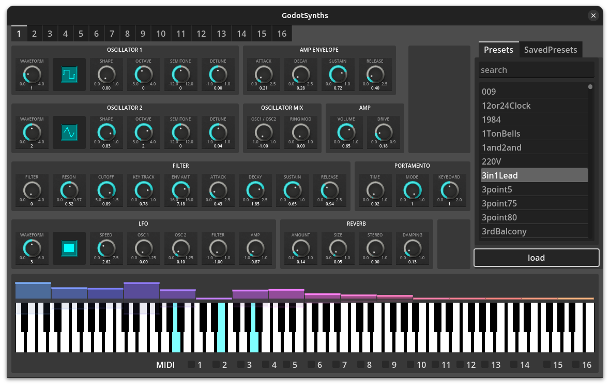

# Godot Csound

---

# Introduction

Hi, I’m **Werner**. I created **Godot-Csound** — an open-source project that brings real-time sound synthesis into the **Godot** game engine.

I’m passionate about game development and open-source software.

I’ve been a hobbyist indie game developer for over 20 years, and professionally I work as a backend software engineer building microservices.

---

## What is Csound?

**Csound** is a powerful, open-source audio synthesis and signal processing system, developed over decades by an incredible community of composers, developers, and researchers.

## Prior Work

Projects like **Cabbage** (which makes VSTs with Csound) and **CsoundUnity** (which integrates Csound with Unity) by **Rory Walsh** were major inspirations for **Godot-Csound**.

## Thanks to Csound Developers

I want to take a moment to thank the **Csound developers** for making such a powerful tool freely available to everyone.

---

# Why Godot-Csound?

For my current game project, I needed a real-time, dynamic music system that could respond directly to gameplay.

Since I'm a strong supporter of open-source software, I wanted a solution that would give me full creative control, without relying on proprietary middleware like **FMOD** or **Wwise** and I also wanted to stay fully within the **Godot** ecosystem, without moving to **Unity**.

That led me to create **Godot-Csound** — a way to integrate **Csound’s** powerful synthesis capabilities directly into **Godot**, making procedural and dynamic audio truly native to the engine.

---

# How It Works

**Csound** is compiled as a shared library for multiple platforms: **Windows**, **macOS**, **iOS**, **Android**, **Linux**, and **WebAssembly**.

**GDExtension** is used to expose **Csound**'s functionality to Godot through the following components:

**CsoundServer**  Used to create and manage instances of **CsoundGodot**.  
  Its API is similar in spirit to Godot’s **AudioServer**.

**CsoundGodot**  Represents a single Csound instance.  
  Multiple instances can run in parallel — similar to Godot's **AudioBus**.

**CsoundAudioStream**  Responsible for driving audio generation in real time.  

---

# Core Features

**Real-Time Audio Synthesis**  Design and generate sound dynamically at runtime using Csound's powerful synthesis engine.

**Parameter Control via GDScript**  Send real-time values from Godot to Csound using simple API calls (`send_control_channel`, `note_on`, `event_string`).

**Custom Instruments via `.csd` Files**  Define your own synthesizers, effects chains, or sound logic using Csound's orchestration language.

---

# Core Features

**Modular Architecture** - Multiple **CsoundGodot** instances can run in parallel, each with its own synth or audio role.

**Seamless Audio Integration** - Csound-generated audio is routed through Godot's AudioServer and can be mixed, spatialized, or processed like any other sound.

**Cross-Platform Support** - Runs on Windows, macOS, Linux, Android, iOS, and the Web (via WASM).

**Open Source & Extensible** - Fully open source and designed for hacking, customization, and integration with other Godot systems.

---

# Csound synthesiser

    !csound
		<CsoundSynthesizer>
		<CsOptions>
		-o dac // real-time output
		</CsOptions>
		<CsInstruments>
		sr = 44100 // sample rate
		0dbfs = 1 // maximum amplitude (0 dB) is 1
		nchnls = 2 // number of channels is 2 (stereo)
		ksmps = 64 // number of samples in one control cycle (audio vector)

		instr 1
		  // get p4 from the score line as amplitude
		  iAmp = p4
		  // get p5 from the score line as frequency
		  iFreq = p5
		  // sawtooth tone with these amplitude and frequency values
		  aOut = vco2:a(iAmp,iFreq)
		  // output to all channels
		  outall(aOut)
		endin

		</CsInstruments>
		<CsScore>
		// call instrument 1 in sequence
		i 1 0 3 0.1 440
		i 1 3 3 0.2 550
		</CsScore>
		</CsoundSynthesizer>

---

# Demo

---

# Future of Godot-Csound

**Plugin Development with Godot** -
Once **libgodot** is available, it will be possible to embed the Godot engine as a library.
This opens the door to building **audio plugins** using Godot — not just games.

**`Goal`: Godot-Powered Audio Plugins** -
Use **libgodot** together with the **DISTRHO Plugin Framework** to create plugins in formats like: **LADSPA**, **DSSI**, **LV2**, **VST2**, **VST3**, and **CLAP**

**Why It Matters** -
Developers and composers could use **Godot** to create **interactive synthesizers and effects** for use in DAWs (Digital Audio Workstations).
Bridging game audio and plugin development — all powered by open source tools.
