# Beyond Audio Playback: Building Interactive Audio Systems in Godot

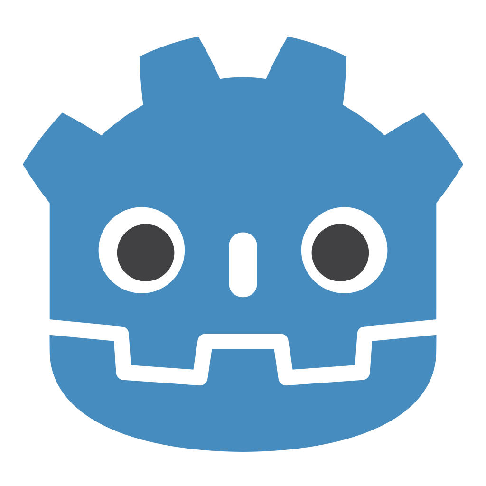

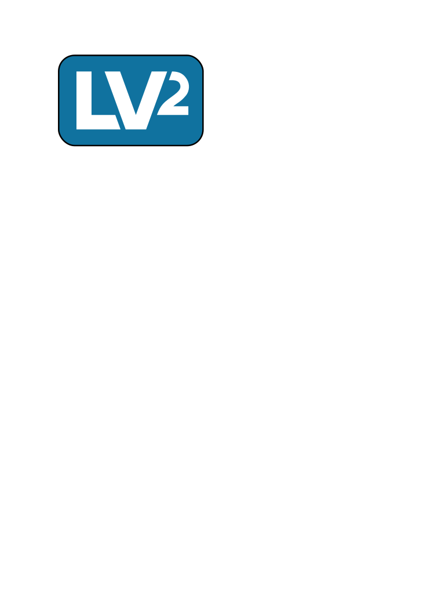

---

# Introduction

Hi, I'm **Werner**. I'm a full-time game developer, software engineer, artist and musician. 
I created **godot-csound**, **godot-lv2-host**, **godot-vst3-host**, and **godot-distrho** — projects focused on real-time synthesis, plugin hosting, and interactive audio in **Godot**.

I’ve been a hobbyist indie game developer for over 20 years, and I have professional experience as a software engineer building and maintaining microservices at scale.

---

## Background - How game audio is usually handled

Musicians use instruments, audio plugins and a digital audio workstation to create music and sound effects.  The audio is then exported as a WAV file and imported into **Godot**.

In **Godot** the imported sound files, music loops, one-shot effects, volume changes and crossfades are used to drive the audio.

This works, but the audio often stays separate from the game logic instead of becoming part of the interactive system.

Optionally game developers use tools like **FMOD** or **Wwise** to create sophisticated audio tracks or a custom audio engine.

---

## Background - How game audio is usually handled

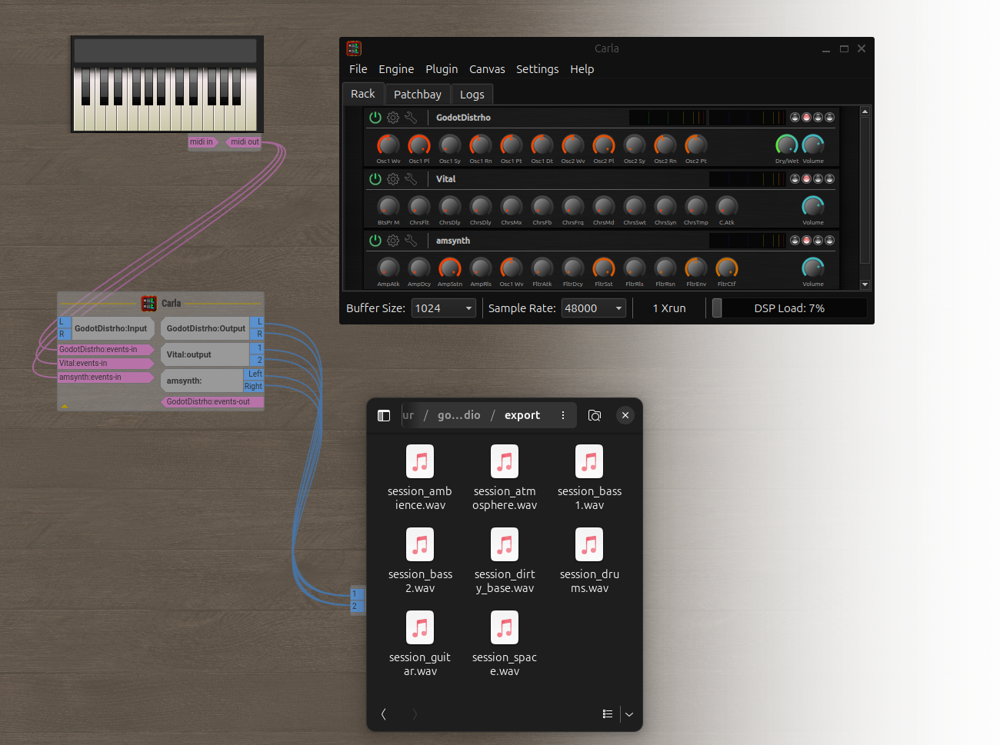

---

## Background - How game audio is usually handled

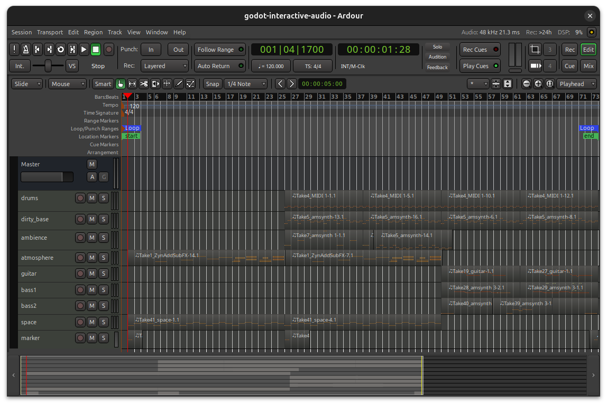

---

## Background - How game audio is usually handled

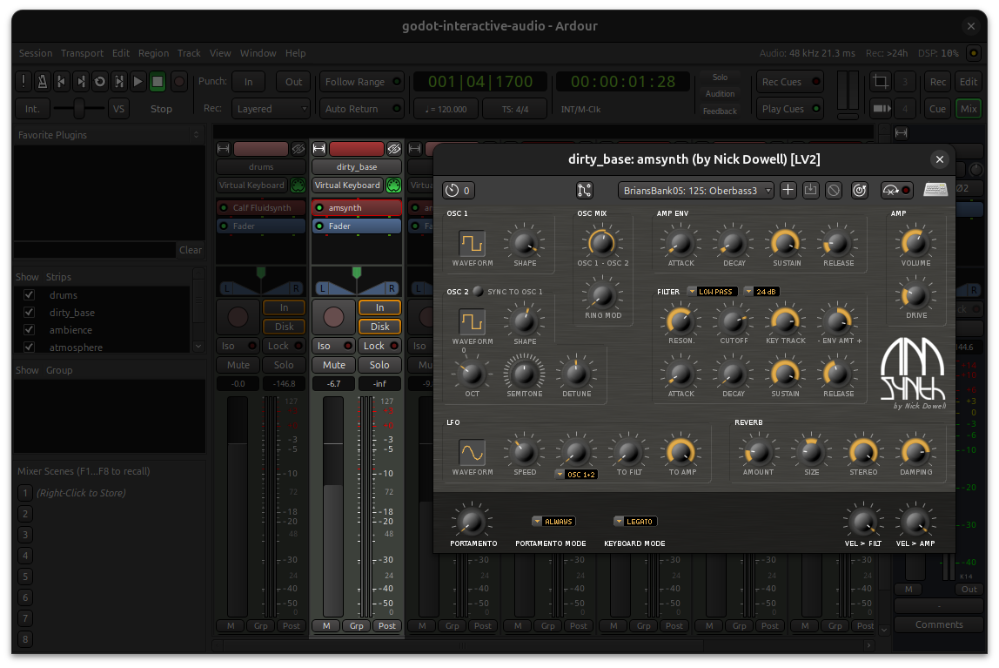

---

## The Vision - Extending Godot’s audio possibilities

Extend **Godot** by using existing audio libraries via **GDExtensions** and add functionality that brings **Godot** closer in features to a digital audio workstation and audio plugin development environment.

Allow **Godot** to be used to create audio plugins, host existing audio plugins and expose the most important features that drive the audio during music creation in a DAW with a focus on dynamic audio playback inside **Godot**.

Expose these new audio features via **GDScript** to allow game events to update the audio and allow for easy-to-use integration in the **Godot** editor.

---

## The Vision - Extending Godot’s audio possibilities

To show how these projects work together, I’ll finish with a Godot demo that:

* Changes musical layers as the player moves between areas.
* Applies real-time effects based on the player's movement and location.
* Increases musical intensity during gameplay.
* Exposes audio parameters and controls that can be adjusted in real time.

---

## Integration - Extending Godot’s audio possibilities

**godot-csound** for synthesis, procedural/interactive sound, dynamic score and programmable instruments and events.

**godot-lv2-host** and **godot-vst3-host** for hosting audio plugins in **Godot**.  Allows for seamless use of the same audio plugins available for a DAW.

**godot-distrho** for building **LV2** and **VST3** audio plugins with **Godot**.  Allows using **Godot** directly inside of a DAW as an audio plugin.

**godot-synths** is example synthesizer written in **Godot** using **Csound** and **DISTRHO** that can be used in all supported platforms and also as an audio plugin in a digital audio workstation.

---

## Integration - godot-csound

**godot-csound** is a **GDExtension** that exposes **Csound's** functionality to **Godot** and supports the following platforms: **Windows**, **macOS**, **iOS**, **Android**, **Linux**, and **WebAssembly**. 

**Csound** is a powerful, open-source audio synthesis and signal processing system, developed over decades by an incredible community of composers, developers, and researchers.

**Csound** uses **csd** files to define instruments, options, and score events. Its API can also dynamically create instruments, modify the score, and trigger real-time MIDI events.

---

## Integration - godot-csound

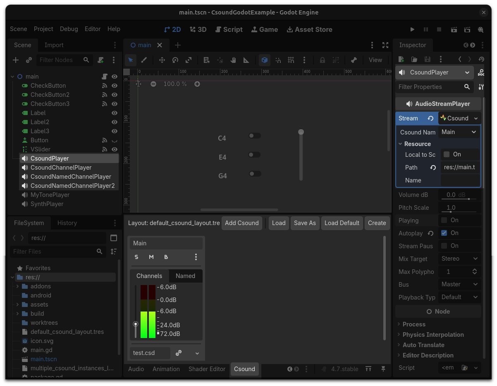

---

## Csound Synthesizer

    !csound
		<CsoundSynthesizer>
		<CsOptions>
		-o dac // real-time output
		</CsOptions>
		<CsInstruments>
		sr = 44100 // sample rate
		0dbfs = 1 // maximum amplitude (0 dB) is 1
		nchnls = 2 // number of channels is 2 (stereo)
		ksmps = 64 // number of samples in one control cycle (audio vector)

		instr 1
		  // get p4 from the score line as amplitude
		  iAmp = p4
		  // get p5 from the score line as frequency
		  iFreq = p5
		  // sawtooth tone with these amplitude and frequency values
		  aOut = vco2:a(iAmp,iFreq)
		  // output to all channels
		  outall(aOut)
		endin

		massign 1, 1
		</CsInstruments>
		<CsScore>
		// call instrument 1 in sequence
		i 1 0 3 0.1 440
		i 1 3 3 0.2 550
		</CsScore>
		</CsoundSynthesizer>

---

## Csound in GDScript

    !gdscript

		extends Node2D
		var csound: CsoundInstance

		func _ready():
			CsoundServer.csound_layout_changed.connect(csound_layout_changed)
			CsoundServer.csound_ready.connect(csound_ready)

		func csound_layout_changed():
			csound = CsoundServer.get_csound("Main")

		func csound_ready(csound_name):
			if csound_name == "Main":
				csound.send_control_channel("cutoff", 1)

		func _on_check_button_toggled(toggled_on: bool):
			if toggled_on:
				csound.note_on(0, 60, 90)
			else:
				csound.note_off(0, 60)

---

## Integration - godot-lv2-host

**godot-lv2-host** is a **GDExtension** that allows using **LV2** audio plugins in **Godot** and supports the following platforms: **Windows**, **macOS** and **Linux**.

**LV2** is an extensible open standard for audio plugins. **LV2** has a simple core interface, which is accompanied by extensions that add more advanced functionality.

Many types of plugins can be built with **LV2**, including audio effects, synthesizers, and control processors for modulation and automation.

**godot-lv2-host** allows using all the existing open-source **LV2** audio plugins in **Godot**.

---

## Integration - godot-lv2-host

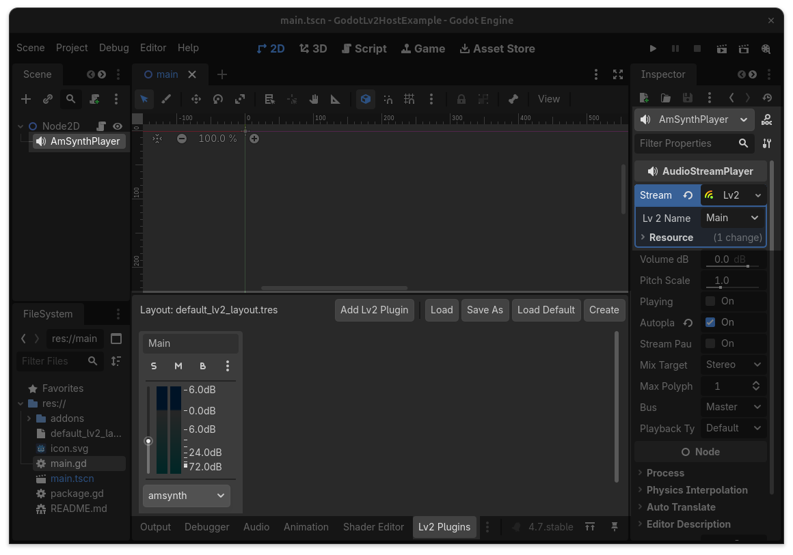

---

## Integration - godot-lv2-host

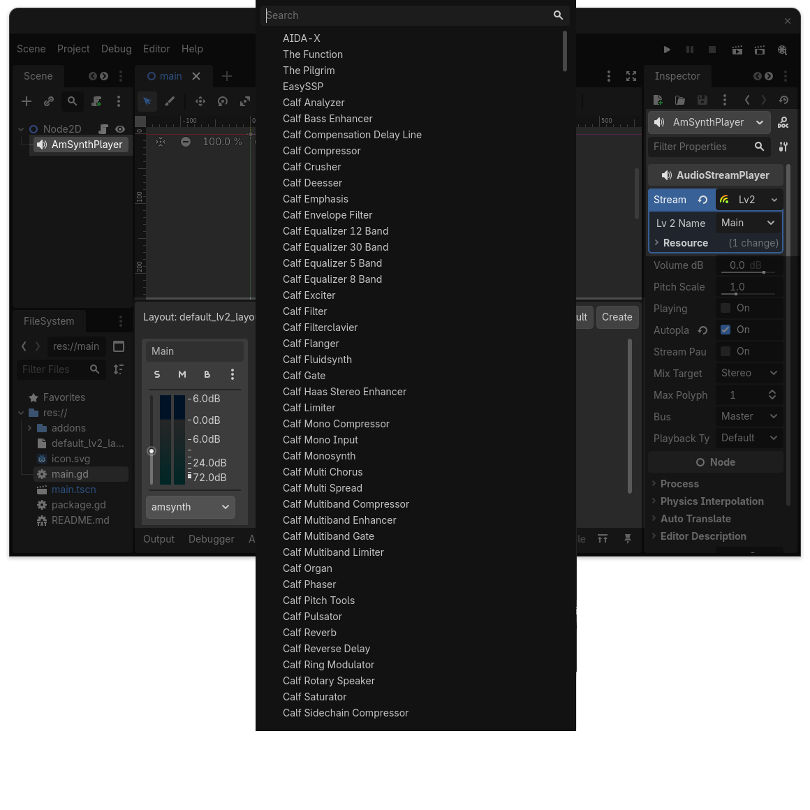

---

## LV2 host in GDScript

    !gdscript

		extends Node2D
		var amsynth: Lv2Instance

        const VOLUME = 14

		func _ready():
            Lv2Server.lv2_ready.connect(lv2_ready)

		func lv2_ready(name):
			amsynth = Lv2Server.get_instance(name)
			amsynth.send_input_control_channel(VOLUME, 1)

		func _on_check_button_toggled(toggled_on: bool):
			var bus = 0
			var channel = 0
			var note = 60
			var velocity = 90

			if toggled_on:
				amsynth.note_on(bus, channel, note, velocity)
			else:
				amsynth.note_off(bus, channel, note)

---

## Integration - godot-vst3-host

**godot-vst3-host** is a **GDExtension** that allows using **VST3** audio plugins in **Godot** and supports the following platforms: **Windows**, **macOS** and **Linux**.

**VST3** is an open source audio plug-in software interface that integrates virtual instruments and effects units into digital audio workstations.

**VST3** and similar technologies use digital signal processing to simulate traditional recording studio hardware in software.

**godot-vst3-host** allows using thousands of existing commercial and freeware **VST3** audio plugins in **Godot**.

---

## Integration - godot-vst3-host

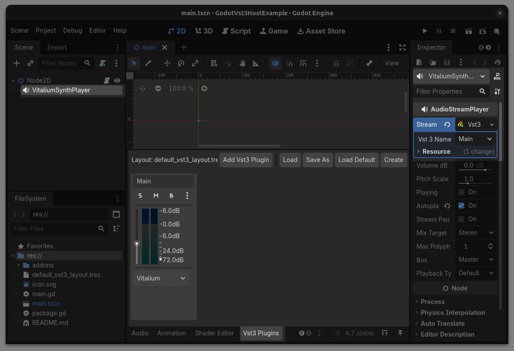

---

## VST3 host in GDScript

	!gdscript

		extends Node2D
		var amsynth: Vst3Instance

		const VOLUME = 462

		func _ready():
			Vst3Server.vst3_ready.connect(vst3_ready)

		func vst3_ready(name):
			amsynth = Vst3Server.get_instance(name)
			amsynth.send_input_parameter_channel(VOLUME, 1)

		func _on_check_button_toggled(toggled_on: bool):
			var bus = 0
			var channel = 0
			var note = 60
			var velocity = 90

			if toggled_on:
				amsynth.note_on(bus, channel, note, velocity)
			else:
				amsynth.note_off(bus, channel, note)

---

## Integration - godot-distrho

**godot-distrho** is a **GDExtension** that uses **DISTRHO** to allow building **LV2** and **VST3** audio plugins using **Godot** and supports the following platforms: **Windows**, **macOS** and **Linux**.

**DISTRHO** is an open-source C++ framework for building cross-platform audio plugins. It handles plugin formats such as **LV2**, **VST**, **CLAP**, and **JACK**, but normally requires native C++ development and separate builds for each target platform.

**godot-distrho** bridges this workflow with **Godot**, allowing **Godot** projects to become part of an audio plugin system while **DISTRHO** handles the plugin format layer.

---

## Integration - godot-distrho

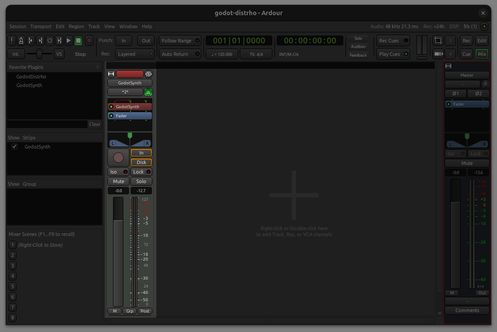
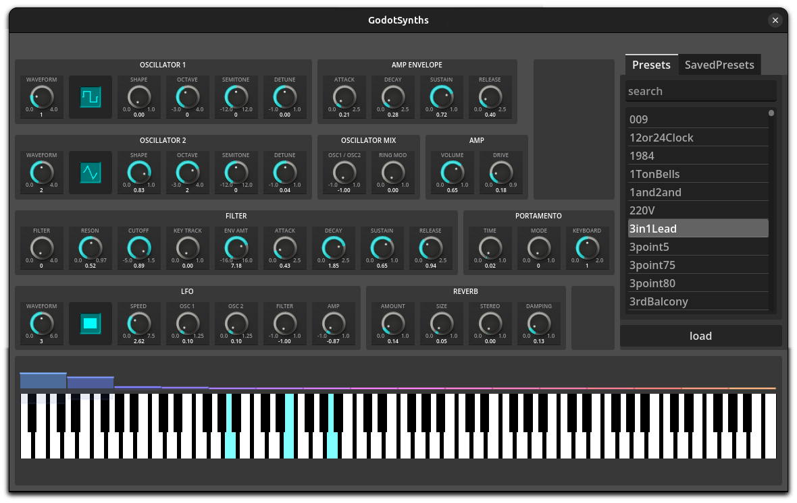

---

## Integration - godot-distrho

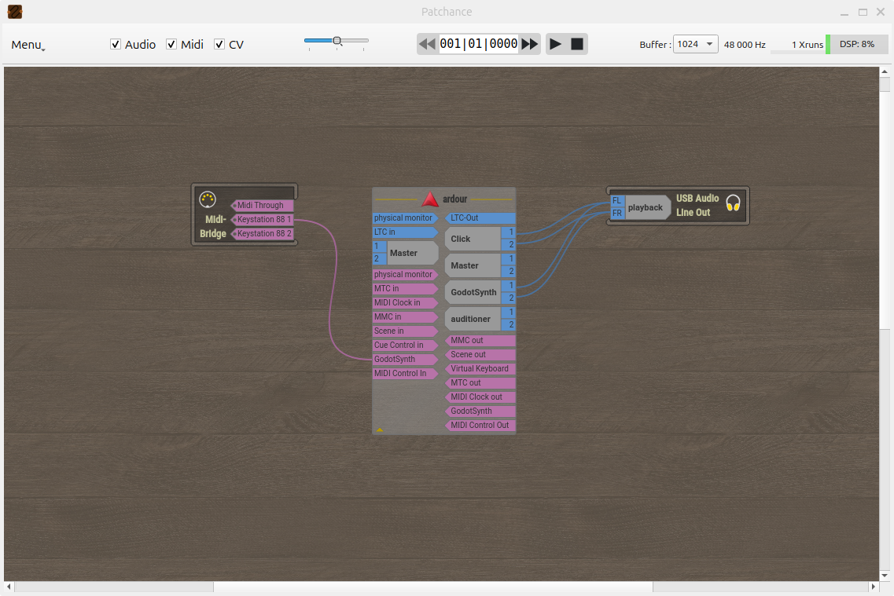

---

## DISTRHO in GDScript

	!gdscript
		#distrho_ui_instance.gd

		extends DistrhoUIInstance

		func _init() -> void:
			DistrhoUIServer.set_distrho_ui(self)

---

## DISTRHO in GDScript

	!gdscript
		#distrho_plugin_instance.gd

		extends DistrhoPluginInstance

		func _init() -> void:
			DistrhoPluginServer.set_distrho_plugin(self)

		func get_name() -> String:
			return "GodotSynth"

		func get_label() -> String:
			return "godot-synth"

		func get_description() -> String:
			return "Godot Synth"

		func get_parameters() -> Array:
			return parameters.map(DistrhoPluginServer.create_parameter)

		func get_input_ports() -> Array:
			return input_ports.map(DistrhoPluginServer.create_audio_port)

		func get_output_ports() -> Array:
			return output_ports.map(DistrhoPluginServer.create_audio_port)

---

## DISTRHO in GDScript

	!gdscript
		#distrho_ui.gd

		extends Node2D

		func _ready() -> void:
			DistrhoUIServer.parameter_changed.connect(_on_parameter_changed)
			DistrhoUIServer.state_changed.connect(_on_state_changed)

		func _input(input_event: InputEvent) -> void:
			if input_event is InputEventMIDI:
				var midi_event: InputEventMIDI = input_event
				if midi_event.message == MIDI_MESSAGE_NOTE_ON:
					DistrhoUIServer.send_note_on(midi_event.channel,
						midi_event.pitch,
						midi_event.velocity)
				if midi_event.message == MIDI_MESSAGE_NOTE_OFF:
					DistrhoUIServer.send_note_off(midi_event.channel, midi_event.pitch)

		func _on_parameter_changed(index: int, value: float) -> void:
			print("UI: Parameter Changed: index: ", index, " value: ", value)

		func _on_state_changed(key: String, value: String) -> void:
			print("UI: State Changed: index: ", key, " value: ", value)

		func _on_amsynth_parameter_changed(parameter: int, value: float) -> void:
			print ("parameter ", parameter, " value = ", value)
			DistrhoUIServer.set_parameter_value(parameter, value)

---

# godot-synths

---

## Integration - Audio workflows and dynamic audio

* Compose music directly inside **Godot** and hear instruments and effects in context while interacting with the scene.
* Build an instrument in **Godot** and export it as an **LV2** or **VST3** plugin.
* Use the plugin in a DAW to compose music and export the resulting **MIDI** tracks.
* Import the MIDI back into **Godot** and adapt the music dynamically during gameplay.
* Use these tools during production, then render the final result to **WAV files** when runtime performance or platform support is a concern.

---

## From playback to interaction

* Move **Godot** from being the destination of audio to becoming part of its creation.
* Shift from playing a recording to conducting an orchestra in real time.
* Transform music from background wallpaper into a character that responds to the player and the story.

---

# Demo

---

## Future Work

* Support additional plugin formats such as **CLAP**.
* Improve plugin compatibility, performance, and platform support.
* Expand automation, sequencing, and dynamic music tools inside **Godot**.
* Create more seamless workflows between **Godot**, audio plugins, and digital audio workstations.

---

## Acknowledgments

This work builds on the efforts of many open-source developers and audio communities.

Special thanks to the contributors and maintainers of:

* **Godot**
* **Csound**
* **Lilv** and the **LV2** ecosystem
* **Steinberg VST3 SDK**
* **DISTRHO Plugin Framework**

Their work made these integrations possible.

---

# Get involved

The projects are open source and available to explore, use, and contribute to. I’m also available for collaboration, integration work, and custom audio tooling.

---

# Questions?

