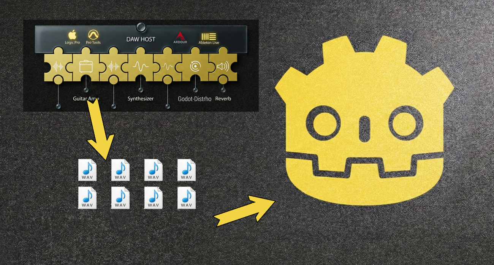
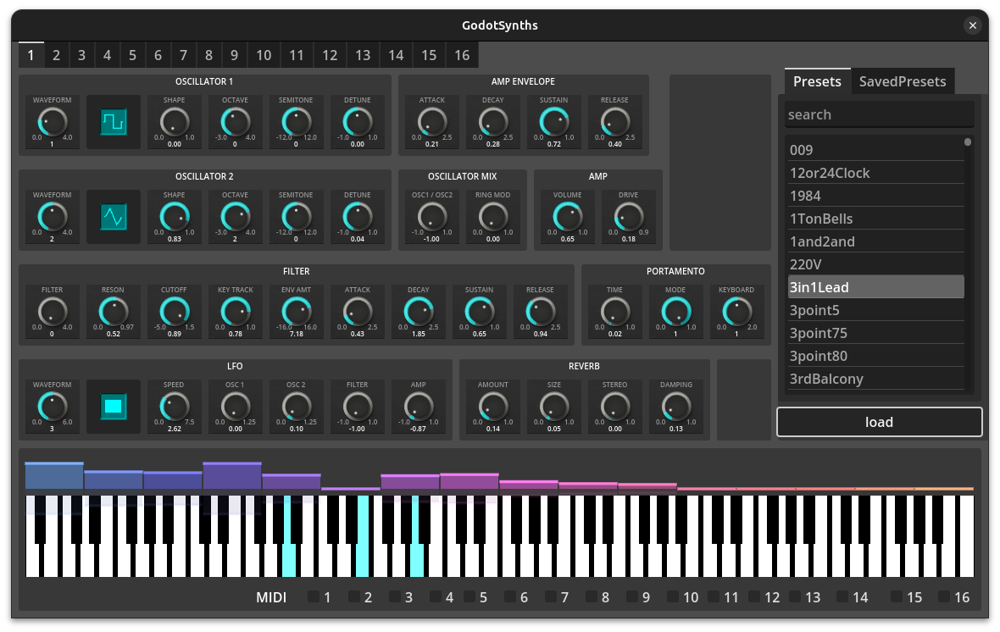

# Godot Audio Stack
.fx: bg-image

---

# Introduction

Hi, I’m **Werner** — a software engineer and indie game developer from San Antonio.

I’m the creator of **Godot-Csound**, **Godot-Distrho**, and **Godot-LV2/VST3-Host** — a set of open-source projects that bring real-time sound synthesis and plugin development into the **Godot** game engine.

I’m passionate about game development and open-source software.
I’ve been a hobbyist indie game developer for over 20 years and have worked professionally as a software engineer.

---

# Game Audio Production Pipeline

- Audio for games is typically created using a DAW (Digital Audio Workstation) and audio plugins (VST3, LV2).
- A sound designer or musician creates songs and sound effects in their software and exports them as assets (WAV, MP3).
- The game then plays back those songs and sounds during gameplay.

Rich audio tools and workflows often get flattened into static audio files.

There are existing proprietary middleware tools like **FMOD** and **Wwise** that allow for procedural audio, but they are not open-source.

---

# Game Audio Production Pipeline

---

# Game Audio Production Pipeline

---

# Godot Audio Stack

---

# Why Godot-Csound?

For my current game project, I needed a real-time, dynamic music system that could respond directly to gameplay.

As a strong supporter of open-source software, I wanted a solution that would give me full creative control without relying on proprietary middleware like **FMOD** or **Wwise**. I also wanted to stay fully within the **Godot** ecosystem, rather than moving to **Unity**.

That led me to create **Godot-Csound** — a way to integrate **Csound’s** powerful synthesis capabilities directly into **Godot**, making procedural and dynamic audio truly native to the engine.

---

# What is Csound?

**Csound** is a powerful, open-source audio synthesis and signal processing system developed over decades by an incredible community of composers, developers, and researchers.

## Prior Work

Projects like **Cabbage** (which makes VSTs with Csound) and **CsoundUnity** (which integrates Csound with Unity), both by **Rory Walsh**, were major inspirations for **Godot-Csound**.

## Thanks to the Csound Developers

I want to take a moment to thank the **Csound developers** for making such a powerful tool freely available to everyone.

---

# Core Features

**Real-Time Audio Synthesis**  
Design and generate sound dynamically at runtime using Csound’s powerful synthesis engine.

**Parameter Control via GDScript**  
Send real-time values from Godot to Csound using simple API calls (`send_control_channel`, `note_on`, `event_string`).

**Custom Instruments via `.csd` Files**  
Define your own synthesizers, effects chains, or sound logic using Csound’s orchestration language.

---

# Core Features

**Modular Architecture** — Multiple **CsoundGodot** instances can run in parallel, each with its own synth or audio role.

**Seamless Audio Integration** — Csound-generated audio is routed through Godot’s AudioServer and can be mixed, spatialized, or processed like any other sound.

**Cross-Platform Support** — Runs on Windows, macOS, Linux, Android, iOS, and the Web (via WASM).

**Open-Source and Extensible** — Fully open-source and designed for hacking, customization, and integration with other Godot systems.

---

# Csound Synthesizer

    !csound
		<CsoundSynthesizer>
		<CsOptions>
		-o dac // real-time output
		</CsOptions>
		<CsInstruments>
		sr = 44100 // sample rate
		0dbfs = 1 // maximum amplitude (0 dB) is 1
		nchnls = 2 // number of channels is 2 (stereo)
		ksmps = 64 // number of samples in one control cycle (audio vector)

		instr 1
		  // get p4 from the score line as amplitude
		  iAmp = p4
		  // get p5 from the score line as frequency
		  iFreq = p5
		  // sawtooth tone with these amplitude and frequency values
		  aOut = vco2:a(iAmp, iFreq)
		  // output to all channels
		  outall(aOut)
		endin

		massign 1, 1
		</CsInstruments>
		<CsScore>
		// call instrument 1 in sequence
		i 1 0 3 0.1 440
		i 1 3 3 0.2 550
		</CsScore>
		</CsoundSynthesizer>

---

# Csound in GDScript

    !gdscript

		extends Node2D
		var csound: CsoundGodot

		func _ready():
			CsoundServer.connect("csound_layout_changed", csound_layout_changed)
			CsoundServer.connect("csound_ready", csound_ready)

		func csound_layout_changed():
			csound = CsoundServer.get_csound("Main")

		func csound_ready(csound_name):
			if csound_name == "Main":
				csound.send_control_channel("cutoff", 1)

		func _on_check_button_toggled(toggled_on: bool):
			if toggled_on:
				csound.note_on(0, 60, 90)
			else:
				csound.note_off(0, 60)

		...

---

# Why Godot-Distrho?

**Plugin Development with Godot** —  By using **libgodot**, it is now possible to embed the Godot engine as a library. This opens the door to building **audio plugins** with Godot — not just game projects.

**`Goal`: Godot-Powered Audio Plugins** —  Use **libgodot** together with the **DISTRHO Plugin Framework** to create plugins in formats like **LADSPA**, **DSSI**, **LV2**, **VST2**, **VST3**, and **CLAP**.

**Why It Matters** —  Developers and composers can use **Godot** to create **interactive synthesizers and effects** for use in DAWs (Digital Audio Workstations), bridging game audio and plugin development with open-source tools.

---

# What is the DISTRHO Plugin Framework?

**DPF** is designed to make developing new plugins easy and enjoyable.
It allows developers to create plugins with custom UIs using a simple C++ API.
The framework supports exporting multiple plugin formats from the same codebase.

## Thanks to the DPF Developers

I want to take a moment to thank the **DPF developers**.

## Godot-Distrho

**Godot-Distrho** allows developers to create audio plugins without writing C++. **Godot** is used to define plugin behavior and route MIDI/audio.

---

# Distrho Plugin Definition in GDScript

    !gdscript
        extends DistrhoPluginInstance

        func _init() -> void:
            DistrhoPluginServer.set_distrho_plugin(self)

        func get_uri() -> String:
            return "https://github.com/nonameentername/godot-distrho"

        func get_parameters() -> Array:
            var parameters = [
                {
                    "name": "Volume",
                    "description": "Volume used to change how loud sound is played",
                    "default_value": 0.5,
                    "min_value": 0,
                    "max_value": 1,
                }
            ]
            return parameters.map(DistrhoPluginServer.create_parameter)

        func get_input_ports() -> Array:
            var ports = [
                {
                    "hints": DistrhoAudioPort.HINT_NONE,
                    "name": "Input Left",
                    "symbol": "input_left",
                    "group_id": DistrhoAudioPort.PORT_GROUP_STEREO
                },
                {
                    "hints": DistrhoAudioPort.HINT_NONE,
                    "name": "Input Right",
                    "symbol": "input_right",
                    "group_id": DistrhoAudioPort.PORT_GROUP_STEREO
                }
            ]

            return ports.map(DistrhoPluginServer.create_audio_port)

---

# Distrho Plugin Definition in GDScript

    !gdscript
        func get_output_ports() -> Array:
            var ports = [
                {
                    "hints": DistrhoAudioPort.HINT_NONE,
                    "name": "Output Left",
                    "symbol": "output_left",
                    "group_id": DistrhoAudioPort.PORT_GROUP_STEREO
                },
                {
                    "hints": DistrhoAudioPort.HINT_NONE,
                    "name": "Output Right",
                    "symbol": "output_right",
                    "group_id": DistrhoAudioPort.PORT_GROUP_STEREO
                }
            ]

            return ports.map(DistrhoPluginServer.create_audio_port)

        func get_state_values() -> Dictionary:
            var midi_keys = {}
            
            for i in range(0, 88):
                midi_keys[str(i)] = "false"

            return midi_keys

		...

---

# Distrho Plugin Logic in GDScript

    !gdscript
        extends Node2D

        @onready var distrho_player = $DistrhoPlayer

        func _ready() -> void:
            DistrhoPluginServer.parameter_changed.connect(_on_parameter_changed)
            DistrhoPluginServer.state_changed.connect(_on_state_changed)
            DistrhoPluginServer.midi_event.connect(_on_midi_event)
            DistrhoPluginServer.midi_note_on.connect(_on_midi_note_on)
            DistrhoPluginServer.midi_note_off.connect(_on_midi_note_off)

        func _on_parameter_changed(index: int, value: float) -> void:
            print("Plugin: Parameter Changed: index: ", index, " value: ", value)
            distrho_player.volume_linear = value

        func _on_state_changed(key: String, value: String) -> void:
            print("Plugin: State Changed: key: ", key, " value: ", value)

        func _on_midi_event(midi_event: DistrhoMidiEvent) -> void:
            DistrhoPluginServer.send_midi_event(midi_event)

        func _on_midi_note_on(channel: int, note: int, velocity: int, frame: int):
            pass

        func _on_midi_note_off(channel: int, note: int, velocity: int, frame: int):
            pass

---

# Distrho UI in GDScript

    !gdscript
        extends Node2D

        func _ready() -> void:
            DistrhoUIServer.parameter_changed.connect(_on_parameter_changed)
            DistrhoUIServer.state_changed.connect(_on_state_changed)

        func _on_parameter_changed(index: int, value: float) -> void:
            print("UI: Parameter Changed: index: ", index, " value: ", value)

        func _on_state_changed(key: String, value: String) -> void:
            print("UI: State Changed: key: ", key, " value: ", value)

        func _on_note_on_button_pressed() -> void:
            DistrhoUIServer.send_note_on(0, 60, 90)

        func _on_note_off_button_pressed() -> void:
            DistrhoUIServer.send_note_off(0, 60)

        func _on_v_slider_value_changed(value: float) -> void:
            DistrhoUIServer.set_parameter_value(0, value)

        func _on_check_button_toggled(toggled_on: bool) -> void:
            DistrhoUIServer.set_state_value("0", str(toggled_on))

        ...

---

# Why Godot-LV2/VST3-Host?

**Use Existing Audio Plugins in Godot** —  Godot can leverage existing **audio plugins** (LV2, VST3) to generate audio in real time.

**`Goal`: Create and Use Audio Plugins within Godot** —  By combining **Godot-Csound** with **Godot-Distrho**, it is now possible to write **audio plugins** that can be used both in **Godot** and in DAWs.

**Why It Matters** —  
Developers can create audio in their favorite DAW using **audio plugins** and then bring those same tools and workflows into **Godot**. 
This also makes it possible to leverage existing open-source **audio plugins** in games, enabling interactive and procedural audio using only open-source software.

---

# How I Used AI for the Godot Audio Stack

## Architect-First Paradigm

Iterate on complex system architectures in a purely conceptual space. Design systems and simulate different implementations before writing code.  Identify potential problems and pitfalls before spending time implementing them.

## Strategy and Planning

Refine ideas, explore tradeoffs, and improve leverage beyond implementation alone.

## Software Development

Accelerate onboarding with new frameworks and technology stacks.

---

# Demo

